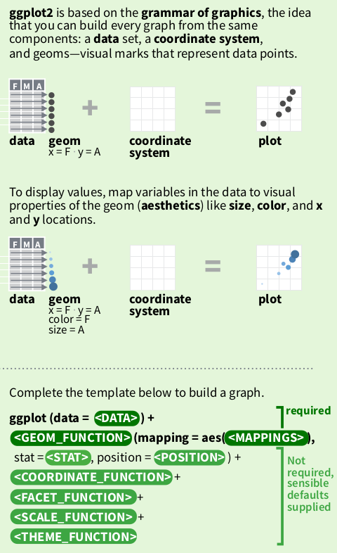

# 1. Grammar of graphics

## Basics


## The `+` operator
```{r, eval = FALSE}
> ggplot2:::`+.gg`
function (e1, e2) {
  e2name <- deparse(substitute(e2))
  if (is.theme(e1))
    add_theme(e1, e2, e2name)
  else if (is.ggplot(e1))
    add_ggplot(e1, e2, e2name)
}

```
ref: [https://stackoverflow.com/questions/40450904/how-is-ggplot2-plus-operator-defined](https://stackoverflow.com/questions/40450904/how-is-ggplot2-plus-operator-defined)


# 2. Time-series plot

## Prepare data
We start by loading the `cases.Rda` file used by the CoMo app
```{r}
#try(lapply(paste('package:',names(sessionInfo()$otherPkgs),sep=""),detach,character.only=TRUE,unload=TRUE), silent = TRUE) # clear additional package space if any is loaded
rm(list = ls()) # delete all objects in current environment

library(rmarkdown) # paged_table
library(ggplot2)

load(url("https://github.com/ocelhay/como/raw/master/inst/comoapp/www/data/cases.Rda"))
ls()
```
Two variables loaded. What's in `cases`

```{r}
paged_table(cases)
```

Get UK specific time series

```{r}
uk_cases <- cases[cases[["country"]] == "United Kingdom",] # filter rows
uk_cases <- uk_cases[c("country", "date", "cases")]        # pick columns
uk_cases <- uk_cases[rowSums(is.na(uk_cases)) == 0,]       # remove NAs
paged_table(uk_cases)
```

## All you need: data + geom_func(aes)
`ggplot2`'s *grammar of graphics* states that graphs are built from 3 components:

 - a data set
 - a coordinate system
 - geoms (specifications of aesthetic elements e.g. x and y locations, shape, size, and colour of data points)

Where a sensible default coordinate system is useful for most graphs, the `<data>` and `<geoms>` components need to be provided by the user.

```{r}
ggplot(data = uk_cases) +                        # data
  geom_point(mapping = aes(x = date, y = cases)) # geom_func(mapping)
```
Replace `geom_point` with `geom_line`
```{r}
ggplot(data = uk_cases) +                       # data
  geom_line(mapping = aes(x = date, y = cases)) # geom_func(mapping)
```
Different `geom`s can be stacked.

```{r}
ggplot(data = uk_cases) +
  geom_point(mapping = aes(x = date, y = cases)) +
  geom_line(mapping = aes(x = date, y = cases)) +
  geom_smooth(mapping = aes(x = date, y = cases), method = "loess", span = .2)
```
More on `geom_smooth`: [https://ggplot2.tidyverse.org/reference/geom_smooth.html](https://ggplot2.tidyverse.org/reference/geom_smooth.html), on `loess` : [https://en.wikipedia.org/wiki/Local_regression](https://en.wikipedia.org/wiki/Local_regression)


## When the `g` in `gg` becomes less obvious

So far the `data + geom_func(aes)` grammar is readable from the code, but we also see some repetition of code segment such as `mapping = aes(x = date, y = cases)`. So we simplify the code knowing the inheritance between `ggplot` and `geom_*` functions (`inherit.aes` property) is true by default.

```{r}
ggplot(uk_cases, aes(x = date, y = cases)) +
  geom_point() + geom_line() + geom_smooth(span = .2)
```
Exactly the same plot. We lost the `data` and `mapping` keywords, and the `aes` definition only appear once in the code. We now have shorter and easier code to maintain, but the *grammar* has become less obvious. This is also why every online tutorial is slightly different to each other despite performing the same actions.


## Adding more data from separate data frames
Get data for United States in `us_cases`.
```{r}
us_cases <- cases[cases[["country"]] == "United States",] # filter rows
us_cases <- us_cases[c("country", "date", "cases")]       # pick columns
us_cases <- us_cases[rowSums(is.na(us_cases)) == 0,]      # remove NAs
paged_table(us_cases)
```


```{r}
ggplot(uk_cases, aes(x = date, y = cases)) +
  geom_point() + geom_line(data = us_cases)
```

The `data = us_cases` statement in `geom_line()` now overwrites the `data = uk_cases` statement inherited from `ggplot`.  [^1]

[^1]:Here the `aes` did not need to be re-stated in `geom_line` despite having a different `data` to plot. Why?

Let's add the world total number of daily cases in to our graph.

```{r}
world_sum <- aggregate(cases[, "cases"], list(date = cases[["date"]]), sum)
world_sum <- world_sum[rowSums(is.na(world_sum)) == 0,]

ggplot(mapping = aes(x = date, y = cases)) +
  geom_line(data = world_sum) + geom_line(data = uk_cases) + geom_line(data = us_cases)

```
Each of the three lines are from a different data frames. [^2]

[^2]: If we remove `mapping = ` from `ggplot` so that it is written like `ggplot(aes(x = date, y = cases)) + ....` would it still work?


## Long vs wide data format

In the example above, we used three separate data frames which resembles a **Wide** data format. For data in this format, each line is stored in a different column, so the `<data>` component needs redefinition in each `<geom>` layer. In a **Long** data format, a column stores the data needed to distinguish the series.

```{r}
world_sum["country"] <- "World Total"
long_data <- rbind(uk_cases, us_cases, world_sum)
ggplot(data = long_data, mapping = aes(x = date, y = cases)) +
  geom_line(aes(colour = country))

```
Note how R automatically added a legend to the plot. This comes when an aesthetic setting is dependent on a column,`colour = country` in this case.


## Colours, labels, scales, and coordinates
(Back to the wide format when no legend is automatically generated by ggplot) We want to improve the graph so that

 - The three time series are distinguishable
 - Both axes are labeled clearly 


```{r}
options(scipen = 999)  # turn off scientific notation like 1e+06

g <- ggplot(mapping = aes(x = date, y = cases)) +
  geom_line(data = world_sum, aes(color = "World"),) +
  geom_line(data = uk_cases,  aes(color = "UK"),) +
  geom_line(data = us_cases,  aes(color = "US"),) +
  labs(x = "Dates (Mar. 2020 to Mar. 2021)", y = "Daily Cases", title = "Covid-19 daily cases comparison", subtitle = "1 year tracker", caption = "source: CoMo") +
  # scale_y_log10(
  #   breaks = scales::trans_breaks("log10", function(x) 10^x),
  #   labels = scales::trans_format("log10", scales::math_format(10^.x))
  # ) +
  scale_y_continuous(
    trans = "log10",
    breaks = scales::trans_breaks("log10", function(x) 10^x),
    minor_breaks = scales::trans_breaks("log10", function(x) 10^x+x),
    labels = scales::trans_format("log10", scales::math_format(10^.x))
  ) +
  annotation_logticks() +
  theme_linedraw() +
  scale_color_manual(name="", values = c("World" = "black", "US"="#50e2c1", "UK"="#faaf3f"))
  
g1 <- g + scale_x_date(date_labels = "%b", date_breaks = "1 month", limits = as.Date(c("2020-03-01", "2021-03-01")))
plot(g1)
```
 - [Scales](https://ggplot2.tidyverse.org/reference/scale_continuous.html)
 - [Axis labels](https://ggplot2.tidyverse.org/reference/labs.html)
 - Log-scale [annotation_logticks](https://ggplot2.tidyverse.org/reference/annotation_logticks.html)
 

## Coordinate system

We can set x range by adjusting the `<coordinate system>` (last element of the grammar) instead.

```{r}
g2 <- g + coord_cartesian(xlim = as.Date(c("2020-03-01", "2021-03-01"))) + scale_x_date(date_labels = "%b", date_breaks = "1 month")

plot(g2)
```

Note how `g1` and `g2` differ at truncating the lines at the beginning:
 - `g1` - setting `limits` in the `scale` function truncates the data before they are plotted
 - `g2` - changing the coordinate system only modifies the viewing-window of the graph


## Annotations

```{r}
uk_peak <- uk_cases[which.max(uk_cases[["cases"]]),]
g11 <- g1 +
  geom_curve(aes(
      xend = uk_peak[["date"]],
      yend = uk_peak[["cases"]],
      x = uk_peak[["date"]]+60,
      y = uk_peak[["cases"]]*1.5
    ),
    curvature = 0.2,
    arrow = arrow(length = unit(10, "points"))
  ) +
  geom_point(data = uk_peak, color = "#ffaf3f") +
  annotate(
    geom = "text",
    label = "UK max",
    x = uk_peak[["date"]]+80,
    y = uk_peak[["cases"]]*1.5
  )
plot(g11)
```
 
More on [annotate](https://ggplot2.tidyverse.org/reference/annotate.html) 


# 3. More plot types

## Scatter
```{r}
per_country_sum <- aggregate(x = list(cases[, "cases"], cases[,"deaths"]), by = list(country = cases[["country"]]), FUN = sum, na.rm = TRUE)

library("countrycode")
per_country_sum[["continent"]] <- countrycode(
                                      sourcevar = per_country_sum[,"country"],
                                      origin = "country.name",
                                      destination = "continent"
                                    )

per_country_sum <- per_country_sum[rowSums(is.na(per_country_sum)) == 0,]
per_country_sum <- per_country_sum[per_country_sum["deaths"] > 10,]

#paged_table(per_country_sum)

g3 <- ggplot(data = per_country_sum, aes(x = cases, y = deaths, colour = continent)) +
  geom_smooth(data = per_country_sum, mapping = aes(colour = NULL), method = "lm", span = .2) +
  geom_point() +
  scale_y_log10(
    breaks = scales::trans_breaks("log10", function(x) 10^x),
    labels = scales::trans_format("log10", scales::math_format(10^.x)),
    limits = c(10,10^6)
  ) +
  scale_x_log10(
    breaks = scales::trans_breaks("log10", function(x) 10^x),
    labels = scales::trans_format("log10", scales::math_format(10^.x)),
    limits = c(10,10^8)
  ) +
  annotation_logticks() +
  coord_fixed()
plot(g3)

```
 
```{r}

min_death_rate <- per_country_sum[
                    which.min(
                      per_country_sum[["deaths"]]/per_country_sum[["cases"]]
                    ),
                  ]
max_death_rate <- per_country_sum[
                    which.max(
                      per_country_sum[["deaths"]]/per_country_sum[["cases"]]
                    ),
                  ]
max_death_count <- per_country_sum[
                    which.max(
                      per_country_sum[["deaths"]]
                    ),
                  ]
max_cases_count <- per_country_sum[
                    which.max(
                      per_country_sum[["cases"]]
                    ),
                  ]

interested_countries <- per_country_sum[is.element(
                            per_country_sum[["country"]],
                            c("United Kingdom", "Australia", "Japan")
                        ),]

highlighted_rows <- rbind(
                      min_death_rate,
                      max_death_rate,
                      max_death_count,
                      max_cases_count,
                      interested_countries
                    )

g31 <- g3 +
  geom_point(
    data = highlighted_rows,
    shape = 4,
    size = 5
  ) +
  geom_label(
    data = highlighted_rows,
    mapping = aes(label = country),
    nudge_x = 0.3,
    nudge_y = 0.4
  )

plot(g31)

```

## Density
```{r}

per_country_sum[["death_rate"]] <- per_country_sum[["deaths"]]/per_country_sum[["cases"]]

g4 <- ggplot(per_country_sum, aes(x = death_rate))
g4 +
  geom_density(aes(color = continent), alpha = 0.4) #+
  #scale_x_continuous(limits = c(0,0.1))


```

## Boxplot
```{r}
#per_country_sum[["death_rate"]] <- per_country_sum[["deaths"]]/per_country_sum[["cases"]]
per_country_sum_no_yemen <- per_country_sum[per_country_sum[["country"]] != "Yemen",]

g5 <- ggplot(
  per_country_sum_no_yemen,
  aes(
    x = continent,
    y = death_rate,
    fill = continent,
  ),
  alpha = 0.5
)
g_vio <- g5 + geom_violin()
g_box <- g5 + geom_boxplot()
plot(g_box)
```

# 4. Other related packages

## ggsci
Scientific Journal and Sci-Fi Themed Color Palettes for ggplot2

## gridExtra
left to right by default
```{r}
library("ggsci")
library("gridExtra")
g_box_npg <- g_box+scale_fill_npg()
g_box_nejm <- g_box+scale_fill_nejm()
g_box_lancet <- g_box+scale_fill_lancet()
g_box_jama <- g_box+scale_fill_jama()
grid.arrange(g_box_npg, g_box_nejm, g_box_lancet, g_box_jama, ncol = 2)
```

## ggExtra

```{r}
library("ggExtra")
ggMarginal(g31, type = "histogram")
```


# References
 - R Basics http://r-statistics.co/R-Tutorial.html
 - Cheat Sheet https://github.com/rstudio/cheatsheets/raw/master/data-visualization-2.1.pdf
 - 50 Examples http://r-statistics.co/Top50-Ggplot2-Visualizations-MasterList-R-Code.html
 - Documentation https://ggplot2.tidyverse.org/index.html
 - `vignette("ggplot2-specs", package = "ggplot2")`
 - ggplot2: Elegant Graphics for Data Analysis https://ggplot2-book.org/introduction.html
 - How is ggplot2 plus operator defined? https://stackoverflow.com/questions/40450904/how-is-ggplot2-plus-operator-defined
 - Be Awesome in ggplot2: A Practical Guide to be Highly Effective - R software and data visualization link
 - grid.arrange https://cran.r-project.org/web/packages/egg/vignettes/Ecosystem.html
