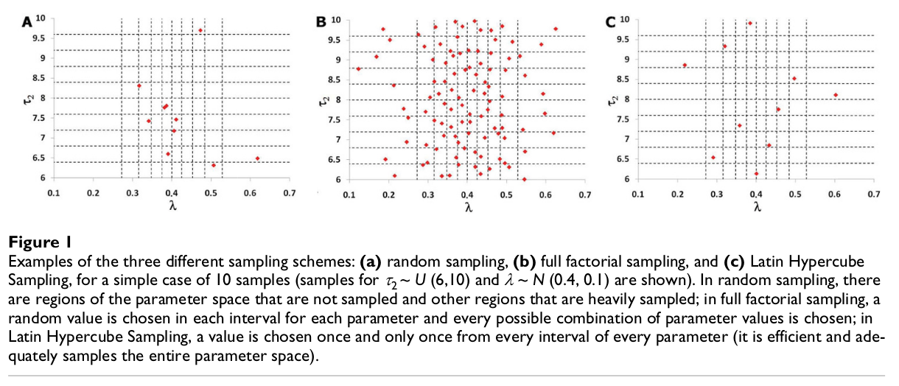
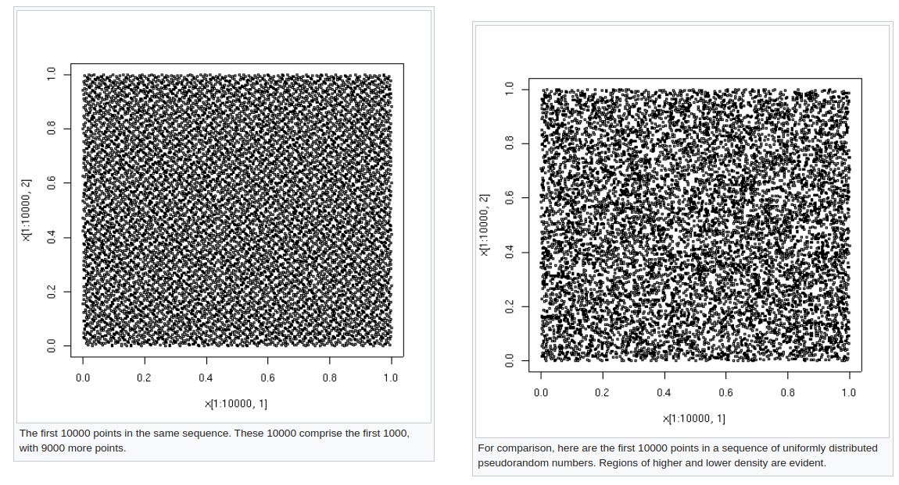
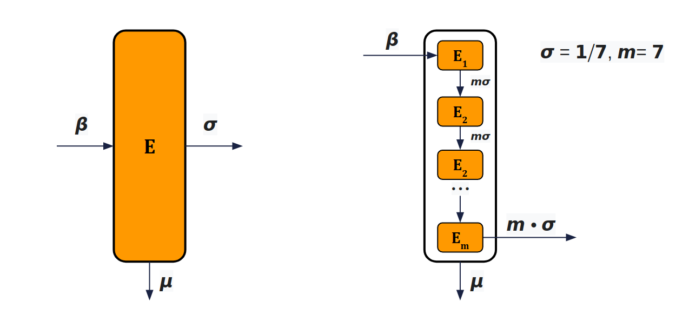

# Overview

Sensitivity analysis is the process of determining how **sensitive** a model is to

 - Changes in parameter values
 - Changes in the structure of the model

By showing how the model respond to these changes, sensitivity analysis is useful in

 - Model building
 - Model evaluation

> *Sensitivity analysis is part of the iterative development cycle of a system dynamic model.*

# Parameter sensitivity

Challenges for a modeller when choosing value for parameters is that in the real world:

 - Many model parameters are difficult or even impossible to measure to a great deal of accuracy.
 - Parameter values change over time.

Therefore, often the modeller can not be certain about the value chosen for a parameter and has to use **estimates**. Sensitivity analysis allows the modeller to determine what level of accuracy is required for a parameter:

 - Greater precision is needed for parameters that the model is sensitive to
 - Less precision is needed for parameters that the model is insensitive to

> By comparing model output to real world observations, sensitivity analysis helps the modeller to choose reasonable values for parameters.

## Sampling

Each input parameter of a model can be defined to have an appropriate **probability density function**. Then, the model can be simulated by **sampling** a single value from each parameter's distribution. Many samples should be taken (and for stochastic models many simulations should be run per sample), producing variable output values.

Sampling value for one parameter is straightforward, but as the dimension of the parameter space increases, the complexity increases exponentially, which can quite easily exceed the available computing resources you have available.

There are various approaches that could be taken to sample from the parameter distributions. In a 2-dimensional parameter space:



### Latin hypercube sampling with the `lhs` package in R

Two parameters of uniform distribution

```{r}
# install.packages("lhs")
library("deSolve")
library("ggplot2") #; library(ggsci)
library("gridExtra")
library("scales") # label_percent()

library("lhs")
set.seed(10)
A <- lhs::randomLHS(5, 2) # 5 samples, 2 parameters
gA <- ggplot(data = data.frame(A), mapping = aes( x = X1, y = X2)) +
  geom_point() + coord_fixed() +
  scale_x_continuous(limits = c(0,1), breaks = seq(0, 1, by = 0.2)) +
  scale_y_continuous(limits = c(0,1), breaks = seq(0, 1, by = 0.2)) +
  labs(title = "A <- lhs::randomLHS(5, 2)")

```
Expand on existing sample
```{r}
A2 <- lhs::augmentLHS(A, 5) # 5 more samples on top of A
A2_new <- A2[!(A2[,1] %in% A[,1] ),]
gA_exp <- ggplot(mapping = aes( x = X1, y = X2)) +
  geom_point(data = data.frame(A)) +
  geom_point(data = data.frame(A2_new), color = "#00A087FF") +
  coord_fixed() +
  scale_x_continuous(limits = c(0,1), breaks = seq(0, 1, by = 0.2)) +
  scale_y_continuous(limits = c(0,1), breaks = seq(0, 1, by = 0.2)) +
  theme(legend.position="none") +
  labs(title = "A2 <- lhs::augmentLHS(A, 5)")
grid.arrange(gA, gA_exp, ncol = 2)
```


X1 is normally distributed

```{r}
B <- lhs::randomLHS(1000, 2) # 1000 samples of 2 parameters
B[,1] <- qnorm(B[,1], mean = 7, sd = 1) # X1 is normally distributed
ggplot(data = data.frame(B)) +
  geom_point(mapping = aes( x = X1, y = X2)) +
  geom_density(mapping = aes(x = X1), color = "#00A087FF", size = 2) +
  scale_x_continuous(limits = c(2,12), breaks = seq(2, 12, by = 1)) +
  scale_y_continuous(limits = c(0,1), breaks = seq(0, 1, by = 0.2))

```

 - [https://cran.r-project.org/web/packages/lhs/vignettes/lhs_basics.html](https://cran.r-project.org/web/packages/lhs/vignettes/lhs_basics.html)
 - [https://github.com/bertcarnell/lhs](https://github.com/bertcarnell/lhs)
 - [https://cran.r-project.org/web/packages/lhs/index.html](https://cran.r-project.org/web/packages/lhs/index.html)


### Sampling with the `sensitivity` package in R

The `sensitivity::parameterSets` function provides three methods of sampling:

 1. Method "sobol" generates uniformly distributed Sobol low discrepancy numbers, using the `sobol`
function in the `randtoolbox` package.

```{r}
library(randtoolbox)
X.sobol <- sensitivity::parameterSets(
  par.ranges = list(X1 = c(1,1000), X2 = c(1,4)),
  samples = 100,
  method = "sobol"
)
plot(X.sobol)
```


 2. Method "grid" generates a grid within the parameter ranges, including its extremes, with number
of points determined by samples
 3. Method "innergrid" generates a grid within the parameter ranges, with edges of the grid offset
from the extremes.

```{r}
library("sensitivity")

X.grid <- sensitivity::parameterSets(
  par.ranges = list(X1 = c(1,1000), X2 = c(1,4)),
  samples = c(8,10),
  method = "grid"
)
plot(X.grid)

X.innergrid <- sensitivity::parameterSets(
  par.ranges = list(X1 = c(1,1000), X2 = c(1,4)),
  samples = c(8,10),
  method = "innergrid"
)
points(X.innergrid, col="red")
```

## Example SEIR model

### Definition

```{r}
rm(list = ls())

library("deSolve")
library("ggplot2") #; library(ggsci)
library("gridExtra")
library("scales") # label_percent()

seir_dt <- function(t, state, parameters){
  with(as.list(c(state, parameters)), {
    theta2 <- theta
    if (lk.on) {
      if (t > lk.t && t < (lk.t + lk.len)) {
        theta2 <- theta * lk.eff
      }
    }

    beta <- theta2 * p
    sigma <- 1/sigmad
    gamma <- 1/gammad

    dSdt = mu - beta*I*S - mu*S
    dEdt = beta*I*S - (sigma+mu)*E
    dIdt = sigma*E - (gamma+mu)*I
    dRdt = gamma*I - mu*R
    return(list(c(dSdt, dEdt, dIdt, dRdt)))
  })  
}

plot_out <- function(out.df) {
  i_max <- out.df[which.max(out.df[["I"]]),]
  ggplot(data = out.df, mapping = aes(x = time))+
    geom_line(mapping = aes(y = S, color = "S")) +
    geom_line(mapping = aes(y = E, color = "E")) +
    geom_line(mapping = aes(y = I, color = "I")) +
    geom_line(mapping = aes(y = R, color = "R")) +
    geom_point(data = i_max, mapping = aes(y = I), color = "#DC0000FF") +
    annotate(
      geom = "text",
      x = i_max[["time"]] + 20, 
      y = i_max[["I"]] + 0.05, 
      label = paste(i_max$time, label_percent()(i_max$I), sep = ", ")
    ) +
    scale_color_manual(name="", values = c("S" = "#3C5488FF", "E"="#F39B7FFF", "I"="#DC0000FF", "R"="#00A087FF")) +
    labs(x = "Time", y = "Population (%)")
}

```


```{r}
# Set estimated parameter values
# beta <- 520/365; # beta = contact_rate * transmission_risk
# sigma <- 1/60; # 1/latent_days
# gamma <- 1/30; # 1/infectious_days
theta_est <- 3
p_est <- 0.15
sigmad_est <- 7 # 1/latent_days
gammad_est <- 24 # 1/infectious_days
# sigmad_est <- 11 # 1/latent_days
# gammad_est <- 7 # 1/infectious_days
mu_est <- 712680/(66650000*365) # UK birth and population figures 2019

# Lockdown
# lk.on_est <- FALSE
lk.t_est <- 15
lk.len_est <- 90
lk.eff_est <- 0.2

init_state <- c(S = 0.98, E = 0.01, I = 0.01, R = 0.0)
timeline <- seq(0,365)

p0 <- c(theta = theta_est, p = p_est, sigmad = sigmad_est, gammad = gammad_est, mu = mu_est,
  lk.on = FALSE, lk.t = lk.t_est, lk.len = lk.len_est, lk.eff = lk.eff_est)

out <- ode(y = init_state, times = timeline, func = seir_dt, parms = p0)
out.df <- data.frame(out)
plot_out(out.df)

```

### With intervention

```{r}

p1 <- c(theta = theta_est, p = p_est, sigmad = sigmad_est, gammad = gammad_est, mu = mu_est,
  lk.on = TRUE, lk.t = lk.t_est, lk.len = lk.len_est, lk.eff = lk.eff_est)

out <- ode(y = init_state, times = timeline, func = seir_dt, parms = p1)
out.df <- data.frame(out)
i_peak <- out.df[which.max(out.df[["I"]]),]
plot_out(out.df)

```

### Sampling

```{r}
seir_fun <- function(parameters){
  with(as.list(c(parameters)), {
    out <- ode(y = init_state, times = timeline, func = seir_dt, parms = parameters)
    out.df <- data.frame(out)
    i_peak <- out.df[which.max(out.df[["I"]]),]
    return(as.numeric(i_peak[["I"]]))
  })
} 

p_set <- sensitivity::parameterSets(
    par.ranges = list(
      theta = c(2, 5),
      p = c(0.1, 0.2),
      sigmad = c(5, 14),
      gammad = c(20, 25),
      mu = c(mu_est, mu_est),
      lk.t = c(30,60),
      lk.len = c(30,120),
      lk.eff = c(0.1, 0.8)
    ),
    samples = c(
      3, 5, 3, 3,
      1, 3, 4, 5
    ), # 8100
    method = "grid"
)

unique(p_set[,"lk.len"])
```
```{r}
seir_fun(c(p_set[20,], lk.on = TRUE))
```

### Simulation

```{r}
f_name <- "results.df.rds"
results.df <- data.frame(p_set)
results.df[["imax"]] <- 0.0

if (!file.exists(f_name)) {
  start_time <- Sys.time()  
  for (rr in 1:nrow(p_set) ) {
  # for (rr in 1:1000 ) {
    pp <- c(p_set[rr,], lk.on = TRUE)
    results.df[rr,"imax"] <- seir_fun(pp)
  }
  end_time <- Sys.time()
  end_time - start_time # Time difference of 2.52515 mins
  saveRDS(results.df, file = f_name)
}

```


```{r}
results.df <- readRDS(f_name)
p_best <- results.df[which.min(results.df[["imax"]]),]
p_best
plot_out(data.frame(
  ode(y = init_state, times = timeline, func = seir_dt, parms = c(p_best, lk.on = TRUE) )))

```

### Sensitivity analysis

```{r}

fs <- c("theta", "p", "sigmad", "gammad", "mu", "lk.t", "lk.len", "lk.eff")
results.df.ft <- results.df
results.df.ft[fs] <- lapply(results.df[fs], factor)

gTheta <- ggplot(data = results.df.ft, aes(x = theta, y = imax)) + geom_boxplot()
gP <- ggplot(data = results.df.ft, aes(x =p, y = imax)) + geom_boxplot()
gSigmad <- ggplot(data = results.df.ft, aes(x = sigmad, y = imax)) + geom_boxplot()
gGammad <- ggplot(data = results.df.ft, aes(x = gammad, y = imax)) + geom_boxplot()
gLkt <- ggplot(data = results.df.ft, aes(x = lk.t, y = imax)) + geom_boxplot()
gLklen <- ggplot(data = results.df.ft, aes(x = lk.len, y = imax)) + geom_boxplot()
gLkeff <- ggplot(data = results.df.ft, aes(x = lk.eff, y = imax)) + geom_boxplot()

grid.arrange(gTheta, gP, gSigmad, gGammad, gLkt, gLklen, gLkeff, ncol = 4)

```


```{r}
library(ggsci)
ggplot(data = results.df.ft, aes(x = lk.len, y = imax, fill = p)) +
  geom_boxplot() +
  facet_grid(lk.t~theta, labeller = label_both) +
  scale_fill_npg()
```

```{r}
#ggplot(data = results.df, aes(x = p, y = theta, color = imax)) + geom_point() + scale_color_gradient(low="blue", high="red")
```

# Structure sensitivity

> ... We argue that if we lack detailed knowledge of the biology of the transmission process, parameter estimation should be accompanied by a structural sensitivity analysis, in addition to the standard statistical uncertainty analysis. ... 

[Lloyd AL. Sensitivity of Model-Based Epidemiological Parameter Estimation to Model Assumptions. Mathematical and Statistical Estimation Approaches in Epidemiology. 2009;123-141. doi:10.1007/978-90-481-2313-1_6](https://www.ncbi.nlm.nih.gov/pmc/articles/PMC7121564/)

## Inclusion of latency (SIR > SEIR)

](img/sir_v_seir.png)

## Gamma distributed latent period

> ... An individual’s chance of recovery is not constant over time: typically, the recovery rate increases over time. In terms of a mathematical model, this leads to the complication that the times at which different individuals became infected must be tracked. ... A mathematical trick allows the inclusion of non-exponential distributions within the compartmental framework. ... [Lloyd AL. 2009](https://www.ncbi.nlm.nih.gov/pmc/articles/PMC7121564/)


We now look at how to track the times at which different individuals became exposed. By subdividing the E compartment into `m` stages:


The progressions between stages occur at constant rate, leading to an exponential waiting time in each stage. The overall latent period is described by the sum of these `m` independent exponential distributions. i.e. latent periods are now gamma distributed with shape parameter `m`.

 - The sum of `k` exponential (`λ`) random variables is a gamma (`k`, `λ`) random variable.
 - `λ` is rate of events (`λ=1/θ`, `θ` being the mean wait time)
 - Mean of exponential distribution of rate `λ` is `1/λ`
 - Mean of gamma distribution, `k` events of rate `λ`, is `k/λ`
 - The exponential distribution predicts the wait time until the **very first** event.
 - The gamma distribution, on the other hand, predicts the wait time until the **k-th** event occurs.

[Gamma Distribution — Intuition, Derivation, and Examples](https://towardsdatascience.com/gamma-distribution-intuition-derivation-and-examples-55f407423840)

 - `k` in out example is the number of subdivided compartments in `E` which is `m`
 - `λ` in our example is the incubation rate `σ`

### Example `SEmIR` model 

```{r}
se7ir_dt <- function(t, state, parameters){
  with(as.list(c(state, parameters)), {
    theta2 <- theta
    if (lk.on) {
      if (t > lk.t && t < (lk.t + lk.len)) {
        theta2 <- theta * lk.eff
      }
    }

    beta <- theta2 * p
    sigma <- 1/sigmad
    gamma <- 1/gammad

    m <- 7

    dSdt = mu - beta*I*S - mu*S
    # dEdt = beta*I*S - (sigma+mu)*E
    dE1dt = beta*I*S - (m*sigma+mu)*E1
    dE2dt = m*sigma*E1 - (m*sigma+mu)*E2
    dE3dt = m*sigma*E2 - (m*sigma+mu)*E3
    dE4dt = m*sigma*E3 - (m*sigma+mu)*E4
    dE5dt = m*sigma*E4 - (m*sigma+mu)*E5
    dE6dt = m*sigma*E5 - (m*sigma+mu)*E6
    dE7dt = m*sigma*E6 - (m*sigma+mu)*E7
    dIdt = m*sigma*E7 - (gamma+mu)*I
    dRdt = gamma*I - mu*R
    return(list(c(
      dSdt,
      dE1dt,
      dE2dt,
      dE3dt,
      dE4dt,
      dE5dt,
      dE6dt,
      dE7dt,
      dIdt,
      dRdt
    )))
  })  
}
init_state_e7 <- c(
  S = 0.98,
  E1 = 0.01/7,
  E2 = 0.01/7,
  E3 = 0.01/7,
  E4 = 0.01/7,
  E5 = 0.01/7,
  E6 = 0.01/7,
  E7 = 0.01/7,
  I = 0.01,
  R = 0.0
)
out0 <- ode(y = init_state, times = timeline, func = seir_dt, parms = p0)
out0.df <- data.frame(out0)
out07 <- ode(y = init_state_e7, times = timeline, func = se7ir_dt, parms = p0)
out07.df <- data.frame(out07)

out07.df[["E"]] <-
          out07.df[["E1"]] +
          out07.df[["E2"]] +
          out07.df[["E3"]] +
          out07.df[["E4"]] +
          out07.df[["E5"]] +
          out07.df[["E6"]] +
          out07.df[["E7"]]
#i_peak <- out7.df[which.max(out7.df[["I"]]),]
g0 <- plot_out(data.frame(out0))
g70 <- plot_out(out07.df)

out1 <- ode(y = init_state, times = timeline, func = seir_dt, parms = p1)
out1.df <- data.frame(out1)
out17 <- ode(y = init_state_e7, times = timeline, func = se7ir_dt, parms = p1)
out17.df <- data.frame(out17)
out17.df[["E"]] <-
          out17.df[["E1"]] +
          out17.df[["E2"]] +
          out17.df[["E3"]] +
          out17.df[["E4"]] +
          out17.df[["E5"]] +
          out17.df[["E6"]] +
          out17.df[["E7"]]
g1 <- plot_out(data.frame(out1))
g71 <- plot_out(out17.df)

grid.arrange(g0, g70, g1, g71,  ncol = 2)
```
A closer look at the comparison between E and I of the two models

```{r}
plot_compare <- function(out.df, out7.df) {
  
  i_max <- out.df[which.max(out.df[["I"]]),]
  i_max7 <- out7.df[which.max(out7.df[["I"]]),]
  e_max <- out.df[which.max(out.df[["E"]]),]
  e_max7 <- out7.df[which.max(out7.df[["E"]]),]
  ggplot( mapping = aes(x = time))+
    geom_line(data = out.df, mapping = aes(y = E, color = "E")) +
    geom_line(data = out.df, mapping = aes(y = I, color = "I")) +
    geom_line(data = out7.df, mapping = aes(y = E, color = "E"), linetype = "dashed") +
    geom_line(data = out7.df, mapping = aes(y = I, color = "I"), linetype = "dashed") +
    geom_point(data = i_max, mapping = aes(y = I), color = "#DC0000FF") +
    geom_point(data = i_max7, mapping = aes(y = I), color = "#DC0000FF") +
    geom_point(data = e_max, mapping = aes(y = E), color = "#F39B7FFF") +
    geom_point(data = e_max7, mapping = aes(y = E), color = "#F39B7FFF") +
    annotate(
      geom = "text",
      x = i_max[["time"]] - 5, 
      y = i_max[["I"]] + 0.05, 
      label = paste(i_max$time, label_percent()(i_max$I), sep = ", ")
    ) +
    annotate(
      geom = "text",
      x = i_max7[["time"]] + 5, 
      y = i_max7[["I"]] + 0.05, 
      label = paste(i_max7$time, label_percent()(i_max7$I), sep = ", ")
    ) +
    annotate(
      geom = "text",
      x = e_max[["time"]] - 5, 
      y = e_max[["E"]] + 0.05, 
      label = paste(e_max$time, label_percent()(e_max$E), sep = ", ")
    ) +
    annotate(
      geom = "text",
      x = e_max7[["time"]] + 5, 
      y = e_max7[["E"]] + 0.05, 
      label = paste(e_max7$time, label_percent()(e_max7$E), sep = ", ")
    ) +
    geom_curve(aes(
        xend = e_max7[["time"]],
        yend = e_max7[["E"]],
        x = e_max[["time"]],
        y = e_max[["E"]]
      ),
      curvature = 0.0,
      arrow = arrow(length = unit(10, "points"))
    ) +
    geom_curve(aes(
        xend = i_max7[["time"]],
        yend = i_max7[["I"]],
        x = i_max[["time"]],
        y = i_max[["I"]]
      ),
      curvature = 0.0,
      arrow = arrow(length = unit(10, "points"))
    ) +
    scale_color_manual(name="", values = c(
      "S" = "#3C5488FF",
      "E" = "#F39B7FFF",
      "E_se7ir" = "#F39B7FFF",
      "I" = "#DC0000FF",
      "I_se7ir" = "#DC0000FF",
      "R" = "#00A087FF")) +
    labs(x = "Time", y = "Population (%)") +
    coord_cartesian(xlim=c(0,70))
}
```
```{r,fig.height = 8, fig.width=8}

p1 <- plot_compare(out0.df, out07.df)
p2 <- plot_compare(out1.df, out17.df)

grid.arrange(p1, p2, ncol = 1, heights =unit(c(10,10), c("cm", "cm")) )

```

> What happens if we subdivide the `I` compartment too?

## Estimating R0 of different models

](img/r0.png)

# References
 - Sampling and sensitivity analyses tools (SaSAT) for computational modelling https://tbiomed.biomedcentral.com/articles/10.1186/1742-4682-5-4#Sec18

 - An introduction to sensitivity analysis https://ocw.mit.edu/courses/sloan-school-of-management/15-988-system-dynamics-self-study-fall-1998-spring-1999/readings/sensitivityanalysis.pdf

 - Handbook of Uncertainty Quantification pp 1103-1122, Introduction to Sensitivity Analysis
 https://link.springer.com/referenceworkentry/10.1007%2F978-3-319-12385-1_31

 - R package `sensitivity` https://cran.r-project.org/web/packages/sensitivity/sensitivity.pdf

 - Overview of advantages and drawbacks of different methods for sensitivity analysis in the context of performance assessment https://igdtp.eu/wp-content/uploads/2017/09/WG1-5_overview_becker.pdf
 - Applying a Global Sensitivity Analysis Workflow to Improve the Computational Efficiencies in Physiologically-Based Pharmacokinetic Modeling https://www.frontiersin.org/articles/10.3389/fphar.2018.00588/full
 